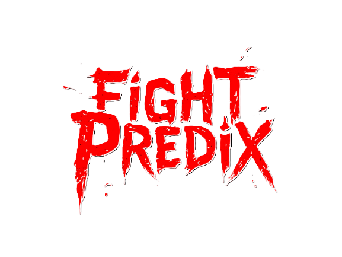

# FightPredixConstructeur

  

## Quelques informations

La fonction récapitulant la plupart de nos travaux de construction se nomme `_main_constructeur` et se situe dans la librairie `lib_constructeur.py`.

Les variables construites reposent sur des principes fondamentaux :

- Les variables numériques sont calculées comme la **différence** entre la valeur de cette variable pour le combattant 1 et celle pour le combattant 2. Vous retrouverez cette construction dans la fonction `_difference_num_combat` de la librairie `lib_constructeur.py`.

- La plupart des statistiques utilisées représentent la **moyenne** des performances du combattant pour la statistique considérée sur l'ensemble de sa carrière avant le combat. Vous retrouverez la construction de ces variables dans la librairie `lib_stats`.

La librairie `lib_nettoyage_avant_preprocess.py` construit la base de données que nous souhaitons utiliser pour construire nos modèles. Parmi les processus :

- Nous imputons les variables **poids**, **taille**, **reach** et **portée de la jambe** entre elles en utilisant le package `MiceForest`.
- Nous retirons les combats ayant eu lieu avant 2014.
- Nous retirons certains combattants jugés très problématiques.
- Nous avons décidé de retirer les lignes contenant plus de **40%** de données manquantes.
- Nous avons décidé de retirer les colonnes contenant plus de **30%** de données manquantes.

## Pistes d'amélioration

Nous sommes conscients que nous pouvons améliorer la qualité de nos modèles en reconsidérant les variables utilisées :

- Pourquoi prendre la moyenne des performances des combattants sur l'ensemble de leurs combats au lieu de la prendre sur leurs trois derniers combats ?
- Des informations supplémentaires comme une blessure récente ou un entraîneur particulier pourraient améliorer la qualité de nos prédictions.
- Utilisation d'analyse textuelle sur des articles en lien avec les combats à venir.

## Prérequis

- Python 3.13

## Fonctionnalités

- Module entièrement documenté pour les interfaces publiques et privées.
- Formatage du code avec `Black` pour respecter les normes de PEP 8.
- Gestion des dépendances avec `uv`.
- Vérification des types avec `Mypy`.
- Tests unitaires et d'intégration avec `Pytest`, et couverture de tests avec `Pytest-cov`.

## Contributeurs

- [Gregory Jaillet](https://github.com/Greg-jllt)
- [Hugo Cochereau](https://github.com/hugocoche)
