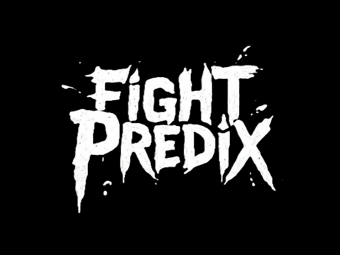

# FightPredixML

  

## Informations Générales

- `scikit-learn` est le package principal utilisé pour les modèles de machine learning.

- La préparation des échantillons de test et d'entraînement se trouve dans la librairie `preparer_echantillons.py`. Vous y trouverez des techniques de symétrisation des données pour gérer la non-linéarité des modèles.
- Les grilles de paramètres utilisées pour l'optimisation des modèles sont disponibles dans la librairie `grille_de_parametres.py`.
- Nous avons fixé le seuil de surapprentissage à 0.05 (différence entre le score sur l'échantillon d'entraînement et le score sur l'échantillon de test). Vous pouvez modifier ce seuil dans `__main__.py`.

- **À lire attentivement** : La procédure d'optimisation utilise tous les cœurs de votre machine moins un. Pensez à ajuster le paramètre `n_jobs` dans `__main__.py` si cela ne vous convient pas.

- Le nombre de plis utilisés pour la validation croisée est de 5. Vous pouvez modifier ce paramètre dans `__main__.py`.

- Les librairies `optimiser_{modele}.py` contiennent les pipelines utilisés pour l'optimisation de chaque modèle.
- La librairie `lib_optimisation.py` regroupe l'ensemble des processus d'optimisation et sauvegarde les meilleurs modèles dans le sous-dossier **modele**.
- La librairie `selectionner_modele.py` contient le processus de sélection du meilleur modèle. Nous éliminons les modèles surajustés puis choisissons le modèle ayant le meilleur score d'entraînement parmi les modèles restants.
- Nous avons utilisé la **précision globale** comme méthode de scoring car cette application a pour objectif de prédire au mieux les probabilités de victoire de chaque combattant

## Pistes d'Amélioration

- Ajouter de nouveaux modèles au processus d'optimisation.
- Améliorer l'adaptabilité du code pour gérer un plus grand nombre de modèles. Nous avons privilégié la lisibilité du code, mais l'ajout de nombreux modèles pourrait le rendre inutilement volumineux.
- Améliorer la gestion des erreurs dans le script actuel.

## Prérequis

- Python 3.13

## Fonctionnalités

- Module entièrement documenté pour les interfaces publiques et privées.
- Formatage du code avec `Black` pour respecter les normes de PEP 8.
- Gestion des dépendances avec `uv`.
- Vérification des types avec `Mypy`.
- Tests unitaires et d'intégration avec `Pytest`, et couverture de tests avec `Pytest-cov`.

## Contributeurs

- [Gregory Jaillet](https://github.com/Greg-jllt)
- [Hugo Cochereau](https://github.com/hugocoche)
